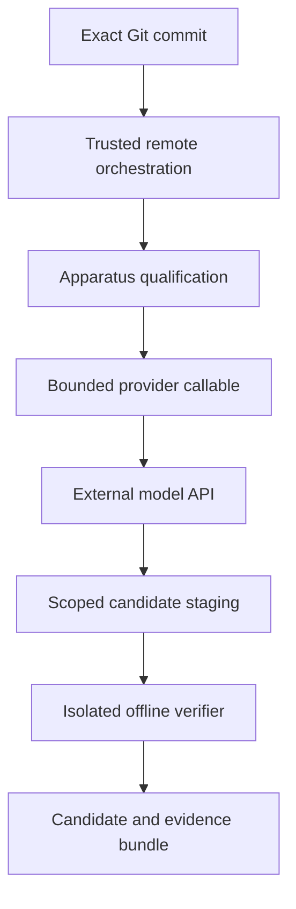

# Hive remote/API architecture

Implementation is based on public recovery branch `recovery/hive-canonical-rc1-replay-readiness` at `63c0281672e130baceafe62b61901e17a73c7fb0`. This is a separate apparatus family, **HIVE-REMOTE-API-QUALIFICATION-001**. It neither consumes nor changes the host-bound RECOVERY-002 contract or one-shot authorization.

## Implemented boundary

The recovered `hive_canonical.controller.produce_candidate(spec, agent_call)` already accepts the required asynchronous `agent_call(role, prompt) -> str`. New code is in `hive_remote/`; every one of the 42 sealed canonical files, every recovery artifact and every historical test remains unchanged. No model-specific verification logic was introduced. The existing `CandidateSpec.local_model` field is a historical metadata label; its name does not require local inference.

The graph describes the target architecture. Today the qualification gate blocks the coding path. Provider smoke uses only the provider/API/evidence path and executes no candidate or verifier.

| Component | Responsibility / implementation |
|---|---|
| Controller | Existing planner/workers/reviewer, staging, exact Java write scope, frozen acceptance, diagnostics projection, candidate hashes, full gate, no promotion |
| Provider protocol | `hive_remote.providers.AgentProvider`: asynchronous role/prompt to text; directly compatible with existing `AgentCall` |
| OpenAI | `OpenAIProvider`: fixed TLS origin, Responses REST endpoint, configurable model and reasoning effort, no tools, no persisted conversation, no retries |
| Ollama | `OllamaProvider`: thin opt-in wrapper over existing historical provider; its historical retries/format policies remain visible; not a newly qualified paired arm |
| Test provider | `MockProvider` plus injected HTTP transport; all offline tests are infrastructure evidence |
| Infrastructure runner | `python -B -m hive_remote.runner preflight|prepare|smoke|experiment`; `experiment` rejects all launches until a separate reviewed remote contract exists |
| Initiation/results | Manual GitHub Actions dispatch and downloadable artifact; exact commit checkout, credentials not persisted, 10-minute job ceiling, serialized runs, 30-day artifact retention |

## Remote platform choice

| Option | Assessment |
|---|---|
| GitHub-hosted Linux runner | Simplest infrastructure smoke and inventory. Public standard Linux runners currently offer 4 CPUs, 16 GB RAM, 14 GB SSD. Capacity alone does not reproduce the attested Windows Python environment, image, cache or NFRT seed. No coding qualification is claimed. |
| Dedicated disposable cloud VM | Preferred **future coding apparatus**, because the reviewed cache and immutable image can remain staged without rebuilding them every job. Estimate 4 vCPUs, 16 GB RAM and at least 60 GB disk for setup; measure actual headroom before qualification. Linux orchestration is a different Python environment requiring a new contract, even with exact verifier image bytes. |
| Additional orchestration container | Not required for the current infrastructure workflow. Containerizing the controller would introduce a further apparatus identity. The existing candidate verifier already uses Docker. |

Do not provision a paid VM or transfer approximately 1.4 GB of third-party cache automatically. The repository expressly records redistribution as unverified. A VM does not resolve those rights or recover absent bytes. A qualified future VM should be disposable, dedicated to trusted manual dispatches, have no unrelated credentials, and permit candidate execution only inside the unchanged networkless verifier. Do not attach it to public PR-triggered jobs.

## API and budget policy

Official OpenAI documentation was opened on 2026-10-07:

- [Responses create](https://developers.openai.com/api/reference/python/resources/responses/methods/create)
- [Count input tokens](https://developers.openai.com/api/reference/resources/responses/subresources/input_tokens/methods/count)
- [Token-counting guide](https://developers.openai.com/api/docs/guides/token-counting)

The implementation uses the supported REST API directly, so it needs no guessed SDK syntax or new SDK dependency. It does not assume a model name or account entitlement. The operator supplies a supported exact model ID. Reasoning effort is optional and is rejected by the API if unsupported; there is no silent fallback.

Each generation is preceded by `/v1/responses/input_tokens` with identical model, input, role instructions and empty tools. Count failure blocks generation. The ledger reserves counted input plus the full configured maximum output before `/v1/responses`; output includes reasoning. Completed response usage settles the reservation. Missing or malformed usage, over-reported usage, timeouts, transport errors, refusals/incomplete responses or cancellation halt future calls. Unsettled reservations remain visible when the charge is unknown. A ledger cannot be reopened to reset its allowance.

Hard limits: model calls, counted input, requested output, total experiment tokens, prompt bytes and wall time. Optional decimal dollar limits reserve using operator-supplied **upper** input/output tariffs without assuming cache discounts. Dollar correctness depends on those tariffs and provider enforcement; this is not an account-level billing guarantee. With no tariff, the hard call/token budget is the equivalent conservative mechanism. The API can charge a request whose response is lost; no automatic retry is permitted. Infrastructure smoke is capped at one generation, 512 input, 16–64 output, 1,024 total tokens, 60-second transport timeout and a 10-minute platform job. Token counting is an additional API request, not a generation call.

## Evidence policy

Requests are exact UTF-8 JSON bytes; successful or failed HTTP response bodies are exact bytes, unless they contain the API credential, in which case saving/returning is refused and the run halts. Prompts and returned text are separately preserved and hashed. Only `x-request-id` is retained from headers. No authorization header or environment dump is recorded. Timing metadata includes request start, response receipt, elapsed time and role-call completion. Model configuration, returned model, response ID, usage, reservations, failure classification and retry count are recorded. The evidence index hashes every file.

| Required run field | Current infrastructure / future coding evidence |
|---|---|
| Run ID / commit / controller identity | `run-identity.json`, qualification report, sealed source manifest hash |
| Provider / configured and returned model / configuration | Per-call `call.json`; exact generation request and response |
| Task / prompts / responses / usage / calls / timings | Prepared J001 plan; per-call prompt/text/HTTP artifacts; `budget.json` |
| Environment / final outcome | Qualification report and `outcome.json` |
| Diff / changed files / candidate hash / targeted and full verification | **Not produced in infrastructure runs.** Existing canonical run records supply these only after an authorized qualified coding run. Missing fields must not be interpreted as empty verified changes. |

Raw verifier material remains human audit evidence. The canonical 001C diagnostic channel, not the provider, controls what can reach correction/reviewer prompts. No hidden test source enters provider smoke or the prepared plan. No automatic apply or promotion endpoint exists in the new path.
