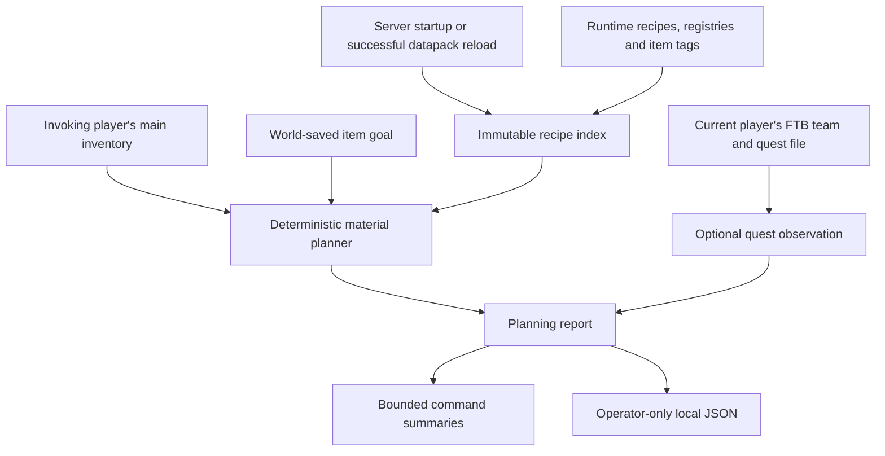

# M2 architecture

ATM Companion 0.2.1 adds runtime recipe knowledge, an optional FTB quest sensor, persistent item goals, and bounded deterministic material planning. Minecraft and mod APIs remain authoritative. The planner consumes detached facts; it does not execute actions or call an AI service.

Quest observations provide context and graph edges. M2 does not infer that a quest unlocks an item recipe, merge an ItemTask display reference into a fixed crafting requirement, or rank quests strategically.

## Provenance and lifecycle

`ATMCompanion` installs `RuntimeKnowledge` and the command registration listener. Live extraction and goal access require the logical server thread. There is no tick scanner, background world reader, or per-command recipe-index rebuild.

`RuntimeKnowledge` holds one immutable index per running server. `ServerStartedEvent` triggers the initial build. NeoForge's `OnDatapackSyncEvent` with a null player triggers a rebuild after a successful global datapack reload; a non-null player represents joining-player synchronization and does not rebuild the index. The old usable entry is invalidated before building the replacement, so a failed rebuild cannot leave stale facts available. A changed `RecipeManager` identity also invalidates an entry defensively. Server stop removes the cache.

`RecipeIndexBuilder` reads the current `RecipeManager`, registry identities, registered output previews, original ingredient values, and current item-tag membership. The resulting `NormalizedRecipe` records contain strings, numbers, booleans, and immutable collections, never live Recipe, ItemStack, registry, player, or world references. Each index records its schema version, generation, build timestamp, counts, coverage, and elapsed build time.

| Fact | Source or derivation |
| --- | --- |
| Recipe ID, type and serializer | Runtime RecipeHolder and registries |
| Output item/count/components | Recipe result preview; only verified classes establish fixed output semantics |
| Original exact items and tag IDs | Original vanilla Ingredient values |
| Resolved alternatives | Current runtime item-tag membership, retained as OR choices |
| Owned materials | ServerPlayer inventory slots 0–35, aggregated by registry ID |
| Goal | Explicit player command, stored in the world's SavedData |
| Quest/task/chapter IDs and flags | Pinned FTB APIs and the invoking player's current team progress |
| Missing resources and selected path | Deterministic calculation over the index and one inventory observation |

The research target's pack/version is documentation, not an invented runtime snapshot field. Core M1 sensors remain available through the existing snapshot model.

## Recipe semantics

Dependency normalization supports exact vanilla shaped/shapeless crafting classes and the vanilla smelting, blasting, smoking, and campfire-cooking classes. These are material models. Cooking still requires unobserved device/fuel/heat and other execution conditions.

An ordinary ingredient retains original item/tag identities and the resolved set of acceptable item IDs. Members are alternatives, not simultaneous requirements. Unknown custom predicates, including simple custom NeoForge ingredients, component-sensitive semantics, empty tags, unknown recipe classes, and incomplete alternative expansion are not silently flattened. Empty tags do not export NeoForge's barrier display placeholder as a material.

Unknown recipe classes may expose useful output previews. Such previews are explicitly nonfixed and unsupported for dependency production. Component-bearing outputs are also excluded from supported material production. Containers, crafting remainders, and byproducts are not credited.

The index keeps a count of every retained recipe for an output and up to 32 lookup routes, preferring supported material models before unsupported previews and then sorting by recipe ID. Route omission is explicit. `complete()` means complete static-output coverage only: no dropped definitions, no unknown/nonfixed outputs, and matching inspected/indexed counts. It never means that all processing conditions or ingredient semantics are understood.

The full-pack playtest exposed global alternative-budget starvation under lexicographic definition selection. The repaired selection policy ranks verified ingredient models by estimated expansion cost before incomplete models and opaque recipe classes, with recipe ID as the final tie-breaker; no namespace is privileged. Unsupported or incomplete raw expansions retain bounded source item/tag identities but drop unusable expanded alternatives. The original global limits remain enforced. Admission remains per ingredient: if a recipe exhausts capacity midway, its preceding positions may remain known, but the recipe as a whole is unsupported. This policy improves bounded coverage; it does not promise that every recipe will fit. Repair verification is tracked in the playtest and adversarial-review documents.

## Planner and resource accounting

`DeterministicPlanner` is a pure service. It receives a `RecipeIndex`, goal item/count, and a copied inventory map. It never mutates the real inventory or the caller's map.

Each candidate path maintains separate ledgers:

- **Remaining original inventory** and **used original inventory** track actual observed ownership once across the entire path.
- **Missing resources** aggregate unresolved leaf deficits across sibling requirements.
- **Planned surplus** tracks hypothetical output remaining after batch rounding. It can satisfy later requirements within that candidate, but never appears as current ownership.

Existing goal items reduce production demand first. Recipe output counts determine the ceiling number of operations. Ingredient quantities multiply by those operations. Requirements with fewer alternatives are considered first to avoid consuming a constrained item for a flexible choice. Alternatives consider currently owned/planned quantities, followed by stable IDs. Each branch has an independent copy of the shared resource ledger.

The search uses bounded beam selection. Candidate ordering prefers fewer unsupported issues, then fewer missing items, shallower paths, fewer steps, and deterministic resource/path tie-breakers. Ancestor tracking stops recipe cycles. Quantity, depth, node, recipe-route, alternative, and beam limits remain explicit. Bounded search can miss a better route or allocation; it is not a global optimizer.

`PlanResult` distinguishes `already_owned`, `materials_ready`, `blocked`, `unsupported`, and `search_limited`. A valid discovered path may retain `materials_ready` while `searchTruncated=true` indicates unexplored alternatives. Neither status proves access to machines, fuel, crafting devices, recipe unlocks, dimensions, or execution capabilities.

The next action first resolves unsupported/limited prerequisites, then a known material deficit, then the first prerequisite recipe in the selected path. Unknown prerequisites are not hidden behind advice to acquire further materials. The planner never credits output from an opaque, cyclic, or limited step as usable surplus.

## FTB quest boundary

`QuestService` uses `OptionalQuestAccess` to check installed FTB Quests version before constructing the typed adapter. The supported release is **2101.1.36**. Missing FTB reports `not_integrated`; incompatible, not-ready, failed, or oversized observations report `unavailable`. Runtime/linkage failures and recursive quest-graph stack overflow are isolated and logged. No FTB type appears in the core service's public signatures.

Every query resolves the invoking player's current FTB team. The adapter uses existing nullable team progress and never creates a team or progression record. No player/team snapshot is cached. Task progress, completion, startability, dependency evaluation, and visibility are direct observations from FTB.

Dependency references do not imply an AND rule. FTB supports different dependency/progression modes; its evaluated `dependenciesSatisfied` and `canStartTasks` flags are exported separately while the unavailable dependency operator remains explicitly unknown. An ItemTask's configured item reference is not an exact material requirement: filters, components, and submission semantics remain unintegrated.

Derived available quests require a visible containing chapter, visible quest, unlocked team, FTB task-start permission, and incomplete status. Cross-chapter quest-link placement is not modeled. Completed repeatable quests are excluded from this derived list. Available choices are sorted by ID, not desirability. `PlanningReport` includes concise quest counts and at most five such options.

## Graph projection

`KnowledgeGraph` is an inspectable projection of the selected recipe path and a bounded portion of observed quest dependencies. It is not a persistent graph database or a complete world model.

Recipe nodes connect to output items with `PRODUCES`, to ingredient-position nodes with `REQUIRES`, and to tag/item alternatives with `SATISFIED_BY`. Edge details explicitly preserve OR semantics and fixed-versus-preview output meaning. Cooking has an unobserved processing-capability requirement. Quest dependency edges preserve FTB references without inventing their logical operator. The graph does not claim item-to-quest unlock relationships that have not been observed.

The projection marks truncation when bounds are reached and never retains an edge whose endpoint was omitted.

## Bounds and failure behavior

| Boundary | Limit |
| --- | --- |
| Recipe definitions visited/retained | 100,000 / 50,000 |
| Recipe index build budget | Cooperative 2 seconds between extraction calls |
| Lookup routes per output | 32 |
| Ingredient alternatives/source values | 256 alternatives; 64 original values |
| Global retained alternatives/identities | 200,000 / 400,000 |
| Tag members inspected per source tag | 4,096 |
| Recipe/item/tag identity length | 256 characters; oversized identities are rejected, not renamed |
| Default planner limits | Depth 10; 768 expanded nodes; 6 routes, alternatives, and beam candidates |
| User goal quantity | 1–4,096; pure planner quantity ceiling 1,000,000 |
| Quest observation | 256 chapters, 8,192 quests; 64 tasks and 256 dependencies per quest |
| Aggregate quest tasks/dependencies | 16,384 / 32,768 |
| Quest collection budget | Cooperative 250 ms; excess returns unavailable |
| Graph projection | 512 nodes, 1,024 edges, at most 64 quests |
| Plan chat | 20 lines, each bounded by the common 240-character formatter |
| Debug JSON | 262,144 UTF-8 bytes |
| Quest debug export | Eight quests per page, with their containing chapters and task records |
| Saved goals | One goal per player, at most 4,096 players per world |

Time limits cannot preempt a single third-party API call safely on the server thread. Commands are throttled and extraction failures remain explicit. Large JSON reports are rejected before replacing the previous export, rather than silently presented as complete. Per-output index limits and planner search limits have separate indicators.

## Persistence and privacy

`GoalSavedData` stores registry item IDs and quantities in the world's standard overworld SavedData, keyed internally by player UUID and shared across dimensions. It stores no cached inventory or plan. Malformed entries are ignored with diagnostics. Clearing one goal does not erase other players' goals.

Gameplay reports omit player/team identities, account/session credentials, server addresses, chat history, and unrelated filesystem content. Operator debug commands write fixed filenames under server-local `config/atm_companion`, with a temporary file and atomic replacement when available. These are shared latest-export files per server; they are not downloaded to clients. Full quest detail is available through a separate eight-quest-per-page export with explicit page/total metadata, rather than being inserted into the raw M1 snapshot.

`AIContext` remains a separate future boundary. M2 contains no LLM, API key, external AI call, embedding service, vector database, or automatic state transmission. The local planning report is structured data, not permission to transmit it.

## Best next engineering step

After the real ATM10 playtest, make execution prerequisites first-class typed facts. Begin with one tightly verified capability, such as reachable vanilla crafting/smelting access and observed fuel, and connect it to material paths without turning unknown access into false absence. This would let M3 distinguish a material-ready path from an executable first step before expanding to optional machine, fluid, power, or storage adapters. Preserve observed facts, planner assumptions, and unverified conditions as separate fields throughout.
