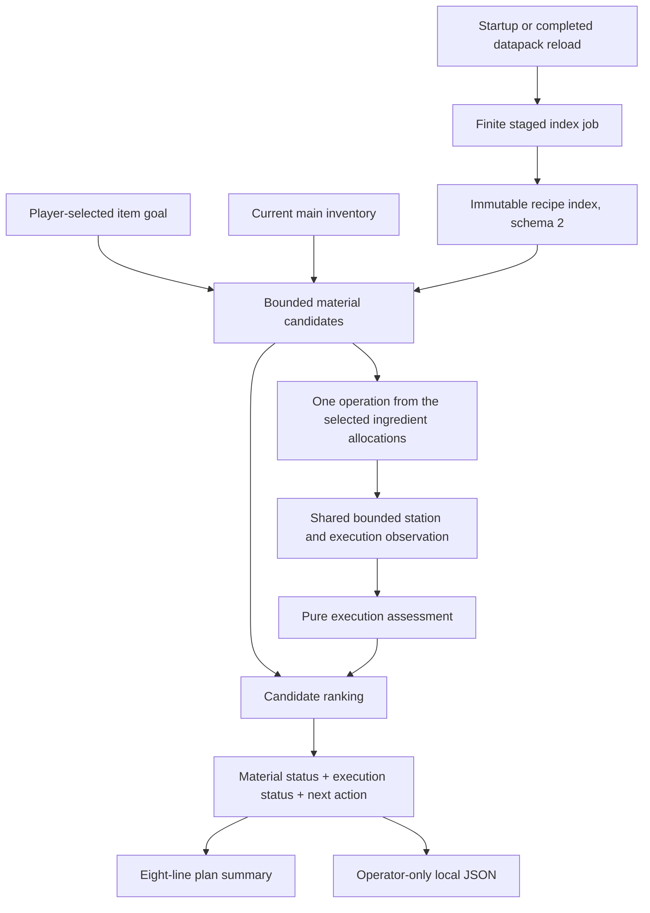

# M3 architecture

M3 connects bounded material plans to observations of vanilla crafting and cooking prerequisites. It assesses one next operation, retains useful alternative paths, and spreads recipe indexing across server ticks. It never crafts, transfers items, consumes fuel, interacts with blocks, or calls an AI service.

This document describes the implementation, not a verification claim. Build, automated-test and actual-pack evidence belongs in `VERIFICATION.md` and the relevant playtest record.

## Ownership and authority

Live Minecraft calls run on the logical server thread. Recipe definitions, tags, player inventory, recipe unlocks, station blocks, station slots and fuel hooks supply observed facts. Pure code computes material reservations and the consequences of those facts. Unknown information remains unknown.

The public recipe index and execution reports contain detached records. The short-lived station session retains copied stacks and live references only for the current request. It rejects reuse after a changed level, recipe manager, game tick or player inventory. It is not a background sensor or a persistent machine cache.

Player-owned resources are still inventory slots 0–35. Equipment, nested inventories, storage networks and nearby station contents are excluded from the material ledger. A nearby station's existing heat or fuel may be observed as an execution condition without becoming an ownership claim.

## Staged recipe knowledge

`RuntimeKnowledge` schedules a new generation on `ServerStartedEvent` and completed global `OnDatapackSyncEvent` with a null player. Joining-player synchronization does not unconditionally rebuild knowledge. Other mods may replace recipes in a later sync listener, including on the first player login. The next server tick checks the source before any extraction; such replacement starts automatic stabilization/recovery. The old entry becomes unavailable immediately. `ServerTickEvent.Post` advances one slice; a finished index is published atomically. Reload replaces a pending job, and server stop removes both pending and completed state.

`RecipeIndexBuilder.Job` has four working phases:

1. **Selecting:** inspect bounded definition metadata and retain inexpensive, supported vanilla ingredient models ahead of incomplete and opaque recipes; recipe ID breaks ties.
2. **Normalizing:** detach registry identities, output facts, original ingredient sources, resolved alternatives and execution requirements.
3. **Lookups:** construct recipe-ID and output-item maps, including bounded supported-first output routes and full retained-route counts.
4. **Freezing:** freeze each output's route list. Publication wraps the completed maps without a bulk copy or final full sort.

The cooperative time slice changes when the job finishes, not which otherwise selected definitions are retained. There is no whole-job elapsed cutoff. Selection visits at most 100,000 definitions and retains at most 50,000. Above the visit ceiling, the source's visited prefix remains partial coverage; the implementation does not claim order-independent coverage of unseen definitions.

Commands can read `RuntimeKnowledge.status()` to distinguish `building`, `recovering`, `ready`, `failed` and `unavailable`, with phase, generation, visited/selected/normalized/lookup counts and timing. `get()` cannot return an earlier generation while replacement work is pending. Synchronous `build` and `rebuild` remain harness/developer seams; normal lifecycle events use staged work.

Freshness checks compare the `RecipeManager`, its recipe-collection identity and count. In the targeted Minecraft 1.21.1 implementation, `getRecipes()` returns `byName.values()`, and `apply`/`replaceRecipes` replace the immutable map. The installed Guava 32.1.2 implementation caches that values view. This detects same-count table replacement without a scan. Unsupported third-party mutation inside an existing recipe object, without replacing the recipe table or completing a reload, is not established by this guard.

M3.1 detects changes before and after each slice and before serving completed knowledge. Replacement clears the old job/index immediately, waits for **20 unchanged actual server ticks**, then builds a fresh generation from the current table. Repeated status/goal calls cannot advance that wait or extract recipes. The `recovering` state exposes a `stabilizing` phase and progress. Commands show actionable availability messages without repeated exception stack traces.

At most **eight automatic starts without a successful publication** are allowed; one uninterrupted stabilization wait is capped at **1,200 server ticks**. Continuous changes restart the stability counter but do not restart the waiting cap. Successful publication resets the recovery budget; explicit startup/reload scheduling begins a new episode. Genuine extraction/inspection errors remain terminal and logged rather than retried. No build-duration timeout is imposed on the finite staged job. A synchronous developer `rebuild` fails promptly if recovery would need future ticks.

Index schema 2 adds execution metadata and coverage telemetry. The pure constructor accepts schema 1 fixtures, whose legacy recipe constructors explicitly use unknown execution requirements. This is not a general migration/import service for old JSON files.

Coverage lists definition limits, invalid identities, unknown/nonfixed outputs, unsupported dependencies, ingredient-retention exhaustion and output-route truncation separately where applicable. `complete()` still means complete static-output coverage only. `Stats.buildMillis` is elapsed lifecycle time, including time between slices; coverage also records active work, slice count and maximum observed slice duration.

## Recipe and execution metadata

Supported material models remain exact vanilla shaped/shapeless crafting and smelting, blasting, smoking and campfire-cooking classes. Pack-provided recipes using those classes are discovered normally. Custom classes, custom ingredient predicates, nondefault output components, empty tags and incomplete expansions remain unsupported for deterministic material production.

`NormalizedRecipe.ExecutionRequirement` records:

- Crafting fit for 2×2 and 3×3 grids from `canCraftInDimensions`.
- Shaped width and height from the live shaped recipe; shapeless dimensions are unspecified.
- Cooking kind and recipe duration from the exact cooking class.

Grid fit is not proof of access. A cooking duration is not a fuel reservation. Static requirements are separated from the fresh execution observation.

Original item/tag identities and OR semantics remain preserved. Unsupported raw expansions do not retain unusable expanded options. Admission is per ingredient: a recipe may retain preceding positions when a later position exhausts capacity, but the entire recipe then remains unsupported. No output from an opaque preview is treated as guaranteed production. Crafting remainders and byproducts are not credited.

## Material search and selected allocations

`DeterministicPlanner.planCandidates` receives an immutable index, a goal and copied inventory counts. Candidate states keep separate remaining-original, used-original, missing-leaf and hypothetical-surplus ledgers. Shared resources are consumed once within each candidate. Hypothetical production never appears as current ownership.

Batch counts use recipe output quantities. Requirements with fewer alternatives are considered first; member ordering prefers remaining observed/planned supply, then item ID. In addition to whole-member branches, bounded unit expansion can manufacture a tag demand from several different members. Every selected step records exact member quantities for each ingredient position across its full batch.

Root routes share a global node ceiling and receive separate quotas from the remaining budget. Beam selection keeps distinct root routes before filling remaining slots with ingredient variants. This prevents an expensive earlier route from freely consuming the budget intended for later routes under normal limits. Extremely small custom node budgets may be insufficient even to admit each root. Routes, ingredient choices, depth and retained candidates are all capped; this is not a complete optimizer.

The pure material ordering prefers fewer issues, fewer missing units, shallower paths, fewer steps and greater use of observed inventory, followed by a canonical path/resource signature. `PlanningService` assesses retained candidates and then orders by issue count, missing units, execution status, depth, path length and stable path representation. A cheaper material path can still rank ahead of a more expensive path with better execution observations; this is an explicit heuristic, not strategic advice.

Alternatives contain root recipe identity, full scalar missing/issue/step counts, bounded excerpts of missing items and blockers, a next action and an execution status. Up to eight missing-resource and blocker records are included per alternative. Unknown custom processing does not become an invented acquisition method.

## One-operation input and fuel accounting

`OperationInputs.select` verifies that a step identifies the same recipe/output/type, that its output agrees with its batch size, and that every ingredient position has exactly the selected full-batch quantity. A current runtime tag member omitted from that selected allocation cannot silently substitute.

For one operation, a constrained-first, deterministic multiset search chooses only selected members, within their per-position quotas and the current inventory. It allocates physical counts once across overlapping positions. Failure returns no partial input list; missing, malformed or bounded-out evidence never establishes readiness.

Fuel inspection receives the material path's entire `ownedRequirements`, not merely the next operation's input. Material items reserved for later steps remain unavailable as fuel. The actual selected cooking input slot is reserved first, preserving its component variant before other stacks with the same item ID. Fuel duration comes from `ItemStack.getBurnTime(recipeType)`; vanilla blast furnaces and smokers apply their duration reduction.

The furnace assessment models existing heat plus at most one additional fuel item. It reserves a conservative tick from observed remaining heat and does not schedule fuel queues, container remainders or every future operation. Existing station input blocks a new operation; station output is checked for space and component compatibility. Existing station contents are never silently withdrawn into the player's resource ledger.

## Station observation and execution status

One planning request shares a `StationService.Session` across candidates. Discovery scans a radius-eight cube in nearby-first shell order, using already-loaded chunks only. It retains the nearest 32 exact vanilla crafting tables, furnaces, blast furnaces, smokers and campfires, with deterministic coordinate tie-breaking. It does not load missing chunks or create missing block entities.

Detailed inspection is limited to exact vanilla block-entity classes and the shared request budget. Observations include vanilla interaction range, world-border/spawn-protection checks, lock matching, occupied slots, lit/waterlogged state and applicable timing data. Timing extraction reads only explicitly whitelisted numeric fields from vanilla serialization; raw NBT, names, lock data and attachments are not exported. Missing or wrong-type timing fields are unavailable, not zero.

Crafting checks grid fit and the actual limited-crafting rule/recipe-book permission. Cooking requires a matching live player input, positive duration and a unique runtime recipe match. The uniqueness check uses a time- and predicate-bounded traversal of the recipe manager; it is not an index rebuild, but can examine many recipe definitions and return unknown if coverage is insufficient. Sessions share this budget across alternatives, so later observations may be less complete.

Execution status is separate from material status:

| Execution status | Meaning |
| --- | --- |
| `not_needed` | The goal is already owned |
| `observed_conditions_met` | Observed vanilla conditions for one operation are satisfied |
| `blocked` | A checked condition prevents the assessed operation |
| `unknown` | Required observation or bounded reasoning was not established |

`observed_conditions_met` is a snapshot statement. Modded claims, interaction-event cancellation, line of sight and safe travel remain unverified. Dead or spectator players do not establish an executable operation. Campfire output drops are not guaranteed recovered items. No action is executed automatically.

## Limits and output

| Boundary | Limit |
| --- | --- |
| Index definition visits / retained recipes | 100,000 / 50,000 |
| Index slice target | Cooperative 5 ms |
| Selection / normalization operations per slice | 512 / 128 |
| Lookup or freeze operations per slice | 512 |
| Routes retained per output | 32 |
| Global retained alternatives / identities | 200,000 / 400,000 |
| Default material search | Depth 10; 768 nodes; 6 routes, alternatives and beam candidates |
| One-operation selector | 64 material units; 512 assignments; 256 inventory identities |
| Station discovery | Radius 8 cube, 4,913 positions, 32 retained stations |
| Shared execution inspection | Cooperative 10 ms; 8 detailed stations; 4,096 predicates |
| Plan summary | 8 lines, common 240-character line bound |
| Local debug JSON | 262,144 UTF-8 bytes |
| Graph projection | 512 nodes, 1,024 edges; at most 64 quests |

A cooperative time target cannot interrupt one third-party recipe, fuel hook, serialization call or JVM pause. Index completion may take hundreds of server ticks in a large pack. Pausing singleplayer also pauses lifecycle work. Shared observation budgets and partial loaded-world coverage can produce different amounts of evidence across requests; unknown results are expected and explicitly reported.

Oversized exports fail before replacing the prior file. Selected-path graph output remains a bounded explanatory projection, not a complete graph database; its generic processing edges do not replace the separate execution assessment.

## Persistence, privacy and deferred work

Item goals remain world SavedData keyed internally by player UUID. Plans, station sessions and index work are not persisted as player memory. Quest observations remain optional, authoritative team context; quest references do not invent recipe unlock dependencies. Plain goal planning does not request quests, while next-action and appropriate debug commands may include them.

Operator debug commands write fixed latest-report files under server-local `config/atm_companion`. They transmit nothing. Reports contain no credentials, server addresses, unrelated chat or filesystem content. `AIContext` remains a future explicit-selection boundary.

M3 does not cover modded workstation execution, fluids, power networks, storage ownership, general gathering methods, safe navigation, automatic interactions, full-chain fuel scheduling or persistent AI memory. Those require their own typed observations and tests rather than extrapolation from vanilla station support.

## M3.2 quest query scopes

Quest integration now has three explicit observation scopes. The readiness probe resolves the supported API, current team and existing progress without scanning the book. `QuestOverview` reads current chapter visibility and quest completion/start permissions for all bounded quests, then resolves titles for at most five available options. Full `QuestSnapshot` still includes task progress, dependency references and detailed titles for operator exports.

`/quests` and `/next` use the overview; `PlanningService.planForNext` carries those counts/options into the unchanged planning context. Its graph contains an `OBSERVATION_UNAVAILABLE` edge for omitted quest details. `/debug plan` and `/debug quests` retain full observations. An overview is never represented as an empty task/dependency graph.

All three resolve the invoking player's current team on the logical server thread. No snapshot of mutable progress is cached. Overview and full collection each retain the cooperative 250 ms deadline, including immutable DTO validation. Full cold collection may still exceed it because FTB lazily resolves many titles. Timeout produces unavailable/null; subsequent requests always reread current facts. IDs use exact uppercase, fixed-width hexadecimal formatting; schema validation reuses compiled patterns. Logs contain bounded counts and phase timings, not player identity or quest contents.
